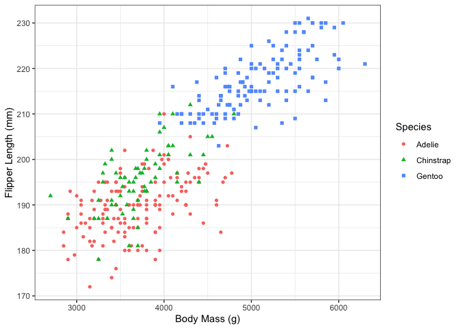
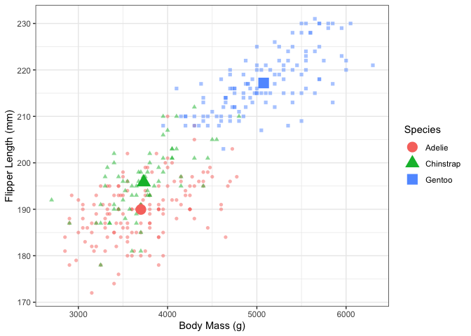
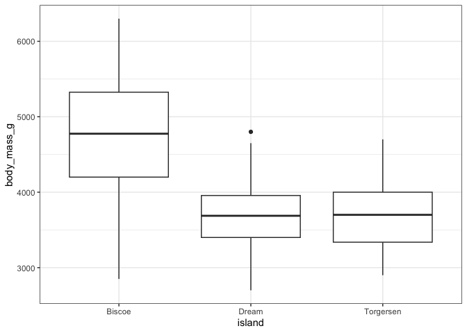
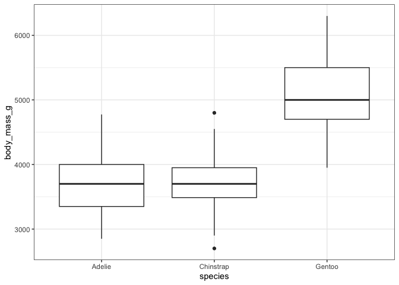

# Coursework Template
Jules Lanari-Collard

<style type="text/css">
h1{
  font-size: 24pt;
}
h2{
  font-size: 18pt;
}
body{
  font-size: 12pt;
}
</style>

# Exploratory Data Analysis

We will investigate the *penguins* dataset provided in the
`palmerpenguins` R package (Horst, Hill, and Gorman 2020). First,
<a href="#tbl-penguins" class="quarto-xref">Table 1</a> shows the
structure of the data:

<div id="tbl-penguins">

Table 1: Sample of Penguins Dataset

<div class="cell-output-display">

| Species | Island | Bill Length (mm) | Bill Depth (mm) | Flipper Length (mm) | Body Mass (g) | Sex | Year |
|:---|:---|---:|---:|---:|---:|:---|---:|
| Adelie | Torgersen | 39.1 | 18.7 | 181 | 3750 | male | 2007 |
| Adelie | Torgersen | 39.5 | 17.4 | 186 | 3800 | female | 2007 |
| Adelie | Torgersen | 40.3 | 18.0 | 195 | 3250 | female | 2007 |
| Adelie | Torgersen | NA | NA | NA | NA | NA | 2007 |
| Adelie | Torgersen | 36.7 | 19.3 | 193 | 3450 | female | 2007 |
| Adelie | Torgersen | 39.3 | 20.6 | 190 | 3650 | male | 2007 |

</div>

</div>

Each row represents a penguin, for which we have information on its
dimensions, species, location and more. We see that some of the rows
contain missing data, so we can add a column showing whether each row
contains any missing data:

``` r
penguins <- penguins %>%
  mutate(missing = if_any(everything(), is.na))
```

We can calculate some statistics for each species:

| Species   | Avg Bill Length (mm) | Avg Flipper Length (mm) |
|:----------|---------------------:|------------------------:|
| Adelie    |                38.82 |                  190.10 |
| Chinstrap |                48.83 |                  195.82 |
| Gentoo    |                47.57 |                  217.24 |

## Plots

We examine the relationship between body mass and flipper length,
grouping by species, in
<a href="#fig-mass-flipper" class="quarto-xref">Figure 1</a> :

<div id="fig-mass-flipper">



Figure 1

</div>

We can add points for the means in
<a href="#fig-means" class="quarto-xref">Figure 2</a> :

<div id="fig-means">



Figure 2

</div>

Finally we compare body mass between islands and species in
<a href="#fig-boxplots" class="quarto-xref">Figure 3</a> :

<div id="fig-boxplots">

<div class="cell-output-display">

<div id="fig-boxplots-1">



(a) Comparison by Island

</div>

</div>

<div class="cell-output-display">

<div id="fig-boxplots-2">



(b) Comparison by Species

</div>

</div>

Figure 3: Means Comparison Plots

</div>

# Code appendix

``` r
knitr::opts_chunk$set(
  collapse = TRUE,
  comment = "#>"
)
include_solutions <- TRUE
require(rmarkdown)
require(knitr)
require(kableExtra)
require(tidyverse)
penguins <- palmerpenguins::penguins
penguins %>%
  head() %>%
  kable(
    col.names=c('Species', 'Island', 'Bill Length (mm)', 'Bill Depth (mm)', 'Flipper Length (mm)', 'Body Mass (g)', 'Sex', 'Year')
  )
penguins <- penguins %>%
  mutate(missing = if_any(everything(), is.na))
penguins %>%
  filter(missing == FALSE) %>%
  group_by(species) %>%
  summarise(avg_bill_length = mean(bill_length_mm, na.rm = TRUE),
            avg_flipper_length = mean(flipper_length_mm, na.rm = TRUE)) %>%
  kable(
    col.names=c('Species', 'Avg Bill Length (mm)', 'Avg Flipper Length (mm)'),
    digits=2
  )
penguins %>%
  ggplot(mapping = aes(x = body_mass_g,
                       y = flipper_length_mm,
                       col = species,
                       shape = species)) +
  geom_point() +
  labs(x = 'Body Mass (g)', y = 'Flipper Length (mm)', colour = 'Species', shape = 'Species') +
  theme_bw()
means <- penguins %>%
  group_by(species) %>%
  summarise(flipper_length_mm = mean(flipper_length_mm, na.rm=TRUE),
            body_mass_g = mean(body_mass_g, na.rm=TRUE))

ggplot(data = penguins, mapping = aes(x = body_mass_g,
                                     y = flipper_length_mm,
                                     col = species,
                                     shape = species)) +
  geom_point(alpha = 0.5) +
  geom_point(data=means, size=5) +
  labs(x = 'Body Mass (g)', y = 'Flipper Length (mm)', colour = 'Species', shape = 'Species') +
  theme_bw()
penguins %>%
  ggplot(mapping = aes(x = island, y = body_mass_g)) +
  geom_boxplot() +
  theme_bw()

penguins %>%
  ggplot(mapping = aes(x = species, y = body_mass_g)) +
  geom_boxplot() +
  theme_bw()
```

# References

<div id="refs" class="references csl-bib-body hanging-indent"
entry-spacing="0">

<div id="ref-palmer-penguins" class="csl-entry">

Horst, Allison Marie, Alison Presmanes Hill, and Kristen B Gorman. 2020.
*Palmerpenguins: Palmer Archipelago (Antarctica) Penguin Data*.
<https://doi.org/10.5281/zenodo.3960218>.

</div>

</div>
